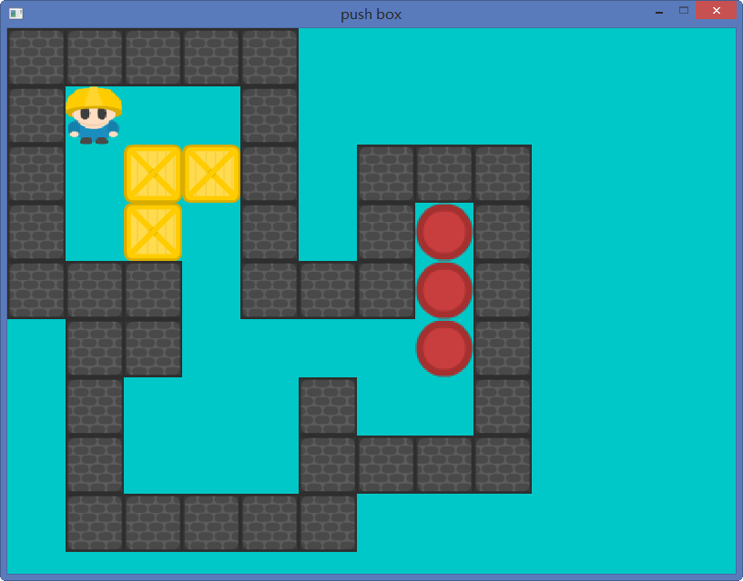
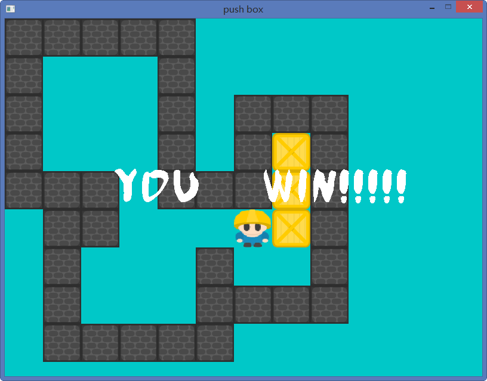

## 说明
该游戏使用了SDL2游戏开发库，c++语法是c++11标准。因为SDL2是跨平台的游戏开发库，所以该游戏的源码可以直接在linux上面编译成功。
##游戏运行截图
游戏开始界面


游戏成功界面




## 游戏更换关卡

源代码里面没有自动生成关卡的代码，游戏的关卡需要从文件读取，读取方式如下


## 一些补充说明

*   如果要更换关卡，请打开round.txt和win.txt，它们两个分别对应着
    关卡初始布局和关卡赢了后的布局。

*   控制人物移动方向使用上下左右键

*   代码里面的矩阵分别代表什么元素

    - 0：代表什么都没有
    - 1：代表墙
    - 2：代表箱子
    - 3：代表玩家
    - 4：代表坑位1：代表墙
*   游戏矩阵如下
    ```cpp
            int t[20][20] = {
                  	{ 0,0,1,1,1,0,0,0 },
                  	{ 0,0,1,4,1,0,0,0 },
                  	{ 0,0,1,0,1,1,1,1 },
                  	{ 1,1,1,2,0,2,4,1 },
                  	{ 1,4,0,2,3,1,1,1 },
                  	{ 1,1,1,1,2,1,0,0 },
                  	{ 0,0,0,1,4,1,0,0 },
                  	{ 0,0,0,1,1,1,0,0 }
                  };
    ```

